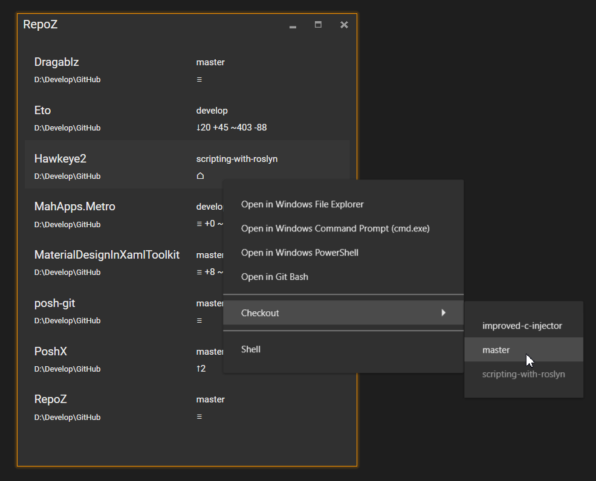
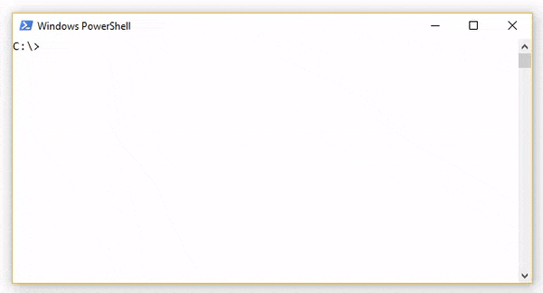
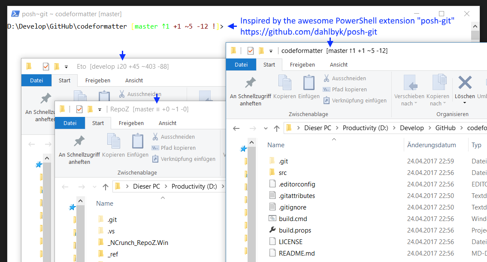

# RepoZ

RepoZ is a handy tool to help you keeping track of local Git repositories on your development machine.

🌈 RepoZ reached "final" :squirrel:  to download the latest binaries! 🌈

## The Tool
It simply provides a quick overview of your repositories including their current branch and a short status info. Additionally, it offers some shortcuts like opening a command line tool and checking out Git branches.

## Command Line Sidekick
RepoZ is a UI-centered tool but comes with a sidekick app called **grr** to empower the command line hackers. 
With **grr**, the information from RepoZ can be brought to any command line tool.

It supports ...
 - listing all repositories found in RepoZ including their branch and status information
 - jumping directly to a repository path (:sparkling_heart:) by adding the `cd` command, like `grr cd RepoZ`
 - filtering for repository names (to list or jump) by regex patterns.
 
See it in action in a ([styled](https://github.com/awaescher/PoshX)) powershell console:

See the topic **Installing grr** on how to to make use of **grr** throughout the system.

## Enhanced Windows Explorer Titles
As an extra goodie for Windows users, RepoZ automatically detects open File Explorer windows and adds a status appendix to their title if they are in context of a Git repository.

### Installing grr
To use **grr** throughout your system like you use **git ...**, you have to add its path to the PATH variable. Currently, this has to be done by hand.

Press `Windows`-`R`, run `SystemPropertiesAdvanced.exe` and click the button "Environment variables ...". You can add the new path to the user "path variable". Don't forget to restart open command line tools to let this setting take effect.
